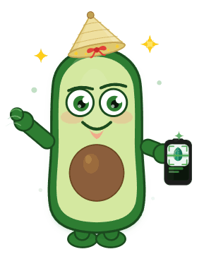

<div align="center">
  
</div>

# CaloEye – AI Nutrition Tracker

> Xin chào! 👋 Tôi là AVO - trợ lý dinh dưỡng của bạn

AI-powered nutrition tracking app. Snap a photo, get instant food analysis, personalized recommendations, and track your nutrition goals.

**Với AVO, ăn uống khôn ngoan chưa bao giờ dễ dàng hơn! 🥗✨**

## 🥑 Meet AVO

**AVO** là nhân vật hướng dẫn của CaloEye - một cô gái tươi vui, luôn sẵn sàng giúp bạn đạt mục tiêu sức khoẻ! Cô ấy sẽ:
- 💭 Tư vấn về dinh dưỡng
- 🎯 Động viên bạn mỗi ngày
- 📈 Theo dõi tiến độ của bạn
- 😊 Làm cho việc ăn uống trở nên vui vẻ

## ✨ Features

- 📸 **AI Food Recognition** – Analyze meals from photos
- 🤖 **AVO AI Advisor** – Chat với AVO để nhận lời khuyên
- 📊 **Complete Tracking** – Calories, macros, weight, streak
- 🔗 **Integrations** – Strava sync, push notifications
- 🔐 **Secure Auth** – Email, OAuth, Passkey (WebAuthn)
- 📱 **PWA Ready** – Works offline, mobile-first
- 👥 **Guest Mode** – Try before signing up

## 🛠️ Tech Stack

- **Backend**: Laravel 11 (PHP)
- **Frontend**: Vue 3 + TypeScript + Vite
- **Database**: MySQL/PostgreSQL
- **State**: Pinia
- **Auth**: Sanctum, OAuth (Google/Facebook), WebAuthn
- **AI**: Google Gemini API
- **PWA**: Vite PWA Plugin

## 🚀 Quick Start

### Install & Setup
```bash
# Backend
composer install
cp .env.example .env
php artisan key:generate
php artisan migrate

# Frontend
npm install
npm run dev

# Or build for production
npm run build
```

### Start Servers
```bash
# Terminal 1: PHP
php artisan serve

# Terminal 2: Vue dev
npm run dev
```

Visit `http://localhost:8000`

## 📁 Project Structure

```
app/                 # Laravel backend
├── Http/Controllers/Api/V1/
├── Models/
└── Services/

resources/js/        # Vue 3 frontend
├── pages/           # Page components
├── components/      # Reusable components
├── composables/     # Logic hooks
├── stores/          # Pinia state
└── router/          # Routes
```

## 📚 Key APIs

```
POST   /api/v1/auth/login           # Login
POST   /api/v1/food/analyze         # AI analyze food
POST   /api/v1/chat                 # Chat with AI advisor
POST   /api/v1/food/log             # Log meal
GET    /api/v1/food/today           # Today's stats
```

See [DEPLOY.md](./DEPLOY.md) for full API docs.

## 🤝 Contributing

1. Branch: `git checkout -b feature/name`
2. Commit: Follow `feat:`, `fix:`, `docs:` prefixes
3. Push & create PR

Code style:
- Backend: PSR-12 (Laravel)
- Frontend: ESLint + Prettier

```bash
npm run lint
npm run test
```

## 📄 License

MIT License

## 👤 Contact

- Email: fboyquangninh@gmail.com
- Issues: GitHub Issues

---

<div align="center">
  <p><strong>AVO nói:</strong> "Hãy bắt đầu ngay hôm nay! Mỗi bữa ăn thông minh là một bước tiến. 🌟"</p>
  <p><em>Cùng AVO, bạn sẽ luôn khỏe mạnh và vui vẻ! 💚</em></p>
</div>
